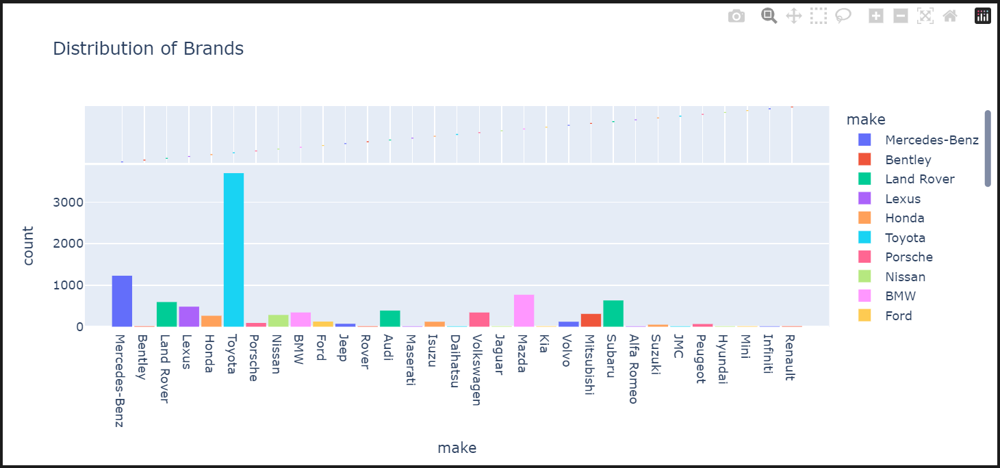

# 🚗 Kenya Car Listings Data Analysis Project

## 📌 Project Overview

This project involves scraping and analyzing car listings from [Jiji.co.ke](https://jiji.co.ke/cars), one of Kenya's most popular online marketplaces. Using Selenium, we collected detailed car data, stored it in a PostgreSQL database, and used SQL and Python for data analysis and visualization. The goal is to gain actionable insights for car buyers and sellers and understand trends in the used and new car markets in Kenya.

## 🎯 Objectives

* Scrape detailed car listings from Jiji.co.ke
* Store the scraped data in a structured PostgreSQL database
* Analyze key car market trends using SQL
* Visualize insights using Python (Pandas, Matplotlib, Seaborn)
* Provide actionable insights for car traders and buyers

## 🔍 Key Research Questions

* What is the resale value of a specific car brands and models in Kenya?

* What are the most in-demand cars in specific regions?

* Is there a preferred price range that buyers are targeting?

* What regions or cities have the highest and lowest average car prices for a specific model?

* Which color variants are most common and do they influence car pricing?

## 🗂️ Data Collection

We used Selenium to extract data for each listing by following links from the car listings homepage. Each listing provided:

* Make, Model, Year
* Price
* Mileage
* Transmission
* Color
* Condition (Foreign/Local/Brand New)
* Location

## 🛢️ Database Schema

The scraped data was stored in a PostgreSQL table called `listings`:

| Column Name  | Data Type |
| ------------ | --------- |
| make         | TEXT      |
| model        | TEXT      |
| year         | INTEGER   |
| price        | INTEGER   |
| mileage      | INTEGER   |
| transmission | TEXT      |
| color        | TEXT      |
| condition    | TEXT      |
| location     | TEXT      |
| listing\_url | TEXT      |

## 📊 Findings and Insights

Based on SQL analysis of the collected data:

* **Toyota** is the most frequently listed brand, followed by **Nissan**.
* **Land Cruiser Prado** is the most commonly listed model.
* Listings with **lower mileage** generally have **higher prices**, regardless of brand.
* **Mombasa** has the highest number of listings, followed by **Nairobi**.
* **Foreign-used** cars dominate the market, followed by **locally used** and **brand new**.
* The most popular **car colors** are white, black, gray, and silver.
* Most cars are priced between **KSh 500,000 and KSh 5,000,000**, indicating a concentrated mid-range market.

## 🧠 Business Implications

### For Sellers:

* Focus on high-demand brands like Toyota and Nissan for quicker sales.
* Sourcing foreign-used vehicles, especially Land Cruiser Prados, can yield higher margins.
* List vehicles in Mombasa for greater visibility or target Nairobi for premium pricing.
* Highlight low mileage in listings to justify higher pricing.
* Stick to neutral colors (white, black, gray) to meet buyer preferences.
* Price vehicles within the KSh 500k–5M range to appeal to the majority of buyers.

### For Buyers:

* Be prepared to pay a premium for low-mileage and foreign-used cars.
* Compare prices between Mombasa and Nairobi for better deals.
* Consider common brands for easier maintenance and resale.
* Buying a high end unit will guarantee you a higher resale value especially German cars.
* Japanese cars are affordable to maintain because of readily available maintenance parts.

## 📊 Visualizations

### Top Car Brands by Listing Frequency

## 🧰 Tools Used

* **Selenium** for scraping
* **PostgreSQL** for storage
* **SQL** for analysis
* **Pandas, Matplotlib, Seaborn** for visualization

## 🚀 How to Run This Project

1. Clone the repository
2. Run the scraper script (`scraper.ipynb`) with Selenium
3. Merge, clean and load the data into the PostgreSQL `Vehicle Database` using `data_processing.ipynb`
4. Use `analysis.sql` for SQL queries
5. Run `visualizations.ipynb` for charts and graphs

## 📌 Future Enhancements

* Add machine learning to predict car prices based on features.
* Build a dashboard using Tableau.